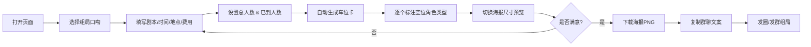

# PRD - 欢乐机制本一分钟组局海报生成器

## 1. 产品概述

面向个人局头和临时想攒局的玩家，一款零门槛纯前端海报生成工具。无需登录注册，通过选择口吻→填写车况→标注车位→导出海报四步，一分钟生成带车位进度的精美组局海报及配套群聊文案，大幅减少反复解释规则、车况和缺人类型的沟通成本。

- 核心价值：让组局信息一眼能懂，让"这车缺什么样的人"可视化呈现
- 目标用户：剧本杀玩家、DM、局头、桌游同好、临时攒局人

---

## 2. 核心功能

### 2.1 用户角色

无需注册，单角色匿名使用。

| 角色 | 注册方式 | 核心权限 |
|------|----------|----------|
| 匿名用户 | 无需注册，打开即用 | 填写表单、生成海报、切换尺寸、导出图片、复制文案 |

### 2.2 功能模块

1. **口吻选择区**：沙雕招募 / 认真找队友 / 新手友好 / 缺气氛担当 共4种风格切换，影响海报配色、文案语气、装饰元素
2. **信息填写表单**：剧本名、总人数、已到人数、时间、地点、费用、可反串、接受新手、已有成员特点
3. **车位配置区**：可视化车位，每个空位可切换角色标签（控场位 / 搞笑位 / 脑洞位 / 随缘位），已占车位自动锁定
4. **实时海报预览**：根据填写内容和口吻风格实时渲染海报，车位进度条直观显示
5. **尺寸切换面板**：朋友圈长图(1080×1920) / 微信群短图(1080×1080) / 店内屏幕图(1920×1080)
6. **群聊文案生成**：根据口吻和车况自动生成招募文案，支持一键复制
7. **图片导出**：一键下载海报为PNG图，支持三种尺寸

### 2.3 页面详情

| 页面名称 | 模块名称 | 功能描述 |
|----------|----------|----------|
| 单页应用 | 顶部导航栏 | 产品名 + 趣味slogan + 口吻风格大标签切换 |
| 单页应用 | 左侧表单区 | 剧本信息填写（可折叠的分组卡片） |
| 单页应用 | 车位配置区 | 交互式车位卡片，空位可切换角色标签 |
| 单页应用 | 右侧海报预览区 | 实时渲染、尺寸切换、导出按钮、文案面板 |
| 单页应用 | 文案区 | 动态生成群聊文案 + 一键复制按钮 |

---

## 3. 核心流程

用户打开页面 → 选择组局口吻风格 → 填写剧本基础信息 → 设置总人数/已到人数 → 系统自动生成车位，空位逐一标注角色标签 → 切换海报尺寸确认效果 → 导出海报PNG → 一键复制群聊文案 → 发圈/发群完成组局

---

## 4. 用户界面设计

### 4.1 设计风格

- **整体基调**：趣味 · 戏谑 · 活力四射，与"欢乐机制本"调性高度契合
- **主色系统（4种口吻独立主题）**：
  - 沙雕招募：荧光橙 `#FF6B35` + 荧光黄 `#FFE66D` + 跳跃紫 `#7B2CBF`（撞色波普风）
  - 认真找队友：深夜蓝 `#1D3557` + 电光青 `#4CC9F0` + 白（赛博冷静风）
  - 新手友好：奶油绿 `#A7C957` + 蜜桃粉 `#F4A261` + 米白（软萌奶油风）
  - 缺气氛担当：霓虹粉 `#F72585` + 电光紫 `#7209B7` + 黑底（夜店霓虹风）
- **按钮风格**：大圆角(12-16px) + 立体阴影(多层box-shadow) + hover时轻微上浮 + 点击时"啪"一下回弹
- **字体**：标题用 **ZCOOL KuaiLe**（站酷快乐体）或 **ZCOOL QingKe HuangYou**（站酷庆科黄油体），正文用 **Noto Sans SC**，数字车位用 **Press Start 2P** 像素风点缀
- **布局风格**：左右分栏桌面端（左表单+右预览），移动端堆叠式；整体卡片错落叠加，配合噪点纹理和斜切装饰
- **图标/表情**：使用 🎭🎲🃏🤡🧠✨🚌🚗 等剧本杀相关emoji，车位卡使用卡通人形占位+角色标签徽章
- **装饰元素**：对角彩带、车票撕边、手绘箭头、拟声词气泡（"冲冲冲！""上车！"）、格纹底纹

### 4.2 页面设计概览

| 页面名称 | 模块名称 | UI 元素 |
|----------|----------|----------|
| 单页应用 | 口吻选择栏 | 4个大卡片横向排列，选中态用抖动动效+高亮边框+放大1.02倍 |
| 单页应用 | 表单分组卡 | 剧本信息📜 / 时间地点📍 / 人员配置👥 / 费用说明💰 四个可折叠分组 |
| 单页应用 | 车位配置 | 圆角矩形车位网格，已占用灰显✅，空位高亮闪烁✨，点击弹出角色标签选择器（控场🎙️/搞笑🤡/脑洞🧠/随缘🎲） |
| 单页应用 | 海报预览 | 带外发光的大预览框，下方尺寸切换Tab，角落放置下载按钮（带旋转动效的打印机图标） |
| 单页应用 | 文案卡 | 仿微信聊天气泡框样式，文案自动根据口吻和车况替换关键词，右侧"复制成功✅"飞字动效 |

### 4.3 响应式

- 桌面端（≥1280px）：左右 45% / 55% 分栏，左表单右预览
- 平板端（768-1279px）：上下堆叠，表单在上预览在下
- 移动端（<768px）：单列堆叠，口吻选择改为两行2×2，车位卡改为横向滚动，海报预览按宽度100%自适应

### 4.4 海报内容结构（预览区核心）

1. **顶部横幅区**：大标题（剧本名）+ 口吻标签 + 装饰emoji
2. **状态进度条**："X/Y人 还差Z位发车！" + 彩色进度条 + 已入座/空位数字
3. **车位网格区**：N个车位卡，已占显示✅成员剪影，空位显示角色标签（控场/搞笑/脑洞/随缘）
4. **信息卡片区**：时间🕒 / 地点📍 / 费用💸 / 反串🔄 / 新手🌱 五项信息徽章
5. **成员特点区**：已有成员特点标签云（如："推土机×2""水龙头×1""气氛组×1"）
6. **底部号召区**：CTA话术（根据口吻变化）+ 底部装饰撕边 + 二维码占位（可选）
