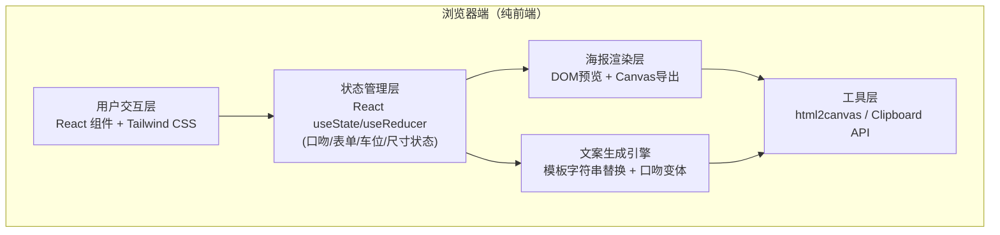

# 技术架构 - 欢乐机制本一分钟组局海报生成器

## 1. 架构设计

纯前端单页应用，无需后端。使用 Canvas API 处理海报渲染导出，html2canvas 作为备选方案。



## 2. 技术描述

- **前端框架**：React@18 + TypeScript@5 + Vite@5
- **UI 方案**：TailwindCSS@3 + PostCSS（零UI库，手工打造独特视觉）
- **海报导出**：html2canvas@1.4.1（DOM转图片） + Canvas API 兜底缩放
- **文案复制**：浏览器原生 Clipboard API
- **初始化工具**：`npm create vite@latest . -- --template react-ts`
- **后端**：无（纯前端静态部署）
- **数据库**：无（使用 localStorage 可选保存草稿）
- **字体加载**：Google Fonts CDN（ZCOOL KuaiLe / ZCOOL QingKe HuangYou / Noto Sans SC / Press Start 2P）

## 3. 路由定义

单页应用，无需路由。

| 路由 | 用途 |
|------|------|
| / | 主页面（口吻选择 + 表单 + 车位配置 + 海报预览 + 文案） |

## 4. 核心数据模型

### 4.1 主要状态 TypeScript 定义

```typescript
type Tone = '沙雕招募' | '认真找队友' | '新手友好' | '缺气氛担当';
type SeatType = '控场位' | '搞笑位' | '脑洞位' | '随缘位' | '已占';
type PosterSize = '朋友圈长图' | '微信群短图' | '店内屏幕图';

interface Seat {
  id: number;
  status: 'filled' | 'empty';
  type?: SeatType;        // 空位时标记角色
  memberTag?: string;     // 已占位置的成员特点标签
}

interface FormData {
  scriptName: string;         // 剧本名
  totalPlayers: number;       // 总人数 (3-12)
  filledPlayers: number;      // 已到人数
  dateTime: string;           // 时间
  location: string;           // 地点
  fee: string;                // 费用
  allowCross: boolean;        // 是否可反串
  allowNewbie: boolean;       // 是否接受新手
  memberFeatures: string[];   // 已有成员特点标签
}

interface PosterConfig {
  tone: Tone;
  form: FormData;
  seats: Seat[];
  size: PosterSize;
}

interface SizeConfig {
  key: PosterSize;
  width: number;   // 实际渲染像素
  height: number;
  displayRatio: number; // 预览时缩放到容器的比例
  label: string;
  emoji: string;
}
```

### 4.2 口吻主题色配置

```typescript
interface ToneTheme {
  name: Tone;
  primary: string;      // 主色
  secondary: string;    // 辅助色
  accent: string;       // 强调色
  bg: string;           // 海报背景
  bgPattern?: string;   // 背景纹理CSS
  text: string;         // 主文字色
  textOnPrimary: string;// 主色上的文字色
  ctaCopy: string[];    // CTA文案变体3条
  tagEmoji: string;     // 口吻标签emoji
  borderRadius: string; // 海报圆角
  decorElements: string[]; // 装饰emoji池
}
```

### 4.3 尺寸预设

```typescript
const SIZE_PRESETS: SizeConfig[] = [
  { key: '朋友圈长图', width: 1080, height: 1920, displayRatio: 0.28, label: '朋友圈', emoji: '📱' },
  { key: '微信群短图', width: 1080, height: 1080, displayRatio: 0.42, label: '微信群', emoji: '💬' },
  { key: '店内屏幕图', width: 1920, height: 1080, displayRatio: 0.32, label: '店内屏', emoji: '🖥️' },
];
```

## 5. 组件划分

```
src/
├── App.tsx                     // 主入口，组装左右两栏
├── main.tsx
├── index.css                   // Tailwind + 全局主题变量 + 字体 + 动画
├── types/
│   └── index.ts                // 所有类型定义
├── config/
│   ├── toneThemes.ts           // 4种口吻主题配置
│   ├── sizePresets.ts          // 尺寸预设
│   └── copyTemplates.ts        // 文案模板池
├── hooks/
│   ├── usePosterState.ts       // 状态管理 hook
│   └── useCopyWriter.ts        // 文案生成 hook
├── components/
│   ├── ToneSelector.tsx        // 口吻选择卡片组
│   ├── FormPanel/
│   │   ├── index.tsx           // 左栏表单容器
│   │   ├── ScriptInfo.tsx      // 剧本信息卡
│   │   ├── DateTimeLocation.tsx// 时间地点费用
│   │   └── PlayerConfig.tsx    // 人数/反串/新手/成员特点
│   ├── SeatConfigurator.tsx    // 车位配置交互区
│   ├── SeatCard.tsx            // 单个车位卡组件
│   ├── PosterPreview/
│   │   ├── index.tsx           // 海报预览容器（含尺寸切换Tab）
│   │   ├── PosterCanvas.tsx    // 实际海报DOM（用于导出）
│   │   └── SizeTabs.tsx        // 尺寸切换按钮组
│   ├── CopyWriterPanel.tsx     // 群聊文案 + 复制按钮
│   └── ExportButton.tsx        // 导出PNG按钮
└── utils/
    ├── exportPoster.ts         // html2canvas封装 + 缩放处理
    └── seatGenerator.ts        // 根据总人数/已到人数生成车位数组
```

## 6. 核心算法与逻辑

### 6.1 车位生成逻辑
```
输入：totalPlayers (N), filledPlayers (M)
输出：Seat[] 长度 N
- 前 M 个 status='filled'，memberTag 从 memberFeatures 循环取
- 后 (N-M) 个 status='empty'，type 默认 '随缘位'，用户可改
```

### 6.2 文案生成逻辑
```
copyTemplates.ts 中按口吻分组维护多套模板
生成时随机挑一条，用 {{变量}} 替换：
{{剧本名}} {{已到}}/{{总人数}} {{缺人数}} {{时间}} {{地点}} {{费用}}
{{可反串/不可反串}} {{接新手/不接新手}} {{车位标签列表}} {{CTA}}
```

### 6.3 海报导出流程
1. 获取 PosterCanvas DOM 节点（已按目标尺寸通过 transform: scale 临时放大）
2. html2canvas 截取，scale参数设为 2（保证高清）
3. 缩放到预设 width/height 精确尺寸
4. 通过 a[download] 触发下载，文件名：`组局_{剧本名}_{时间戳}.png`

## 7. 性能与体验要点
- 使用 React.memo 包裹纯展示组件，避免表单输入时海报预览不必要重渲染
- 车位变更时使用 useCallback 缓存处理函数
- html2canvas 导出时显示 loading 遮罩 + 动效（1-3秒）
- 表单内容自动存入 localStorage，刷新不丢
- 所有输入框带合理默认值，打开页面即可看到完整海报样例
